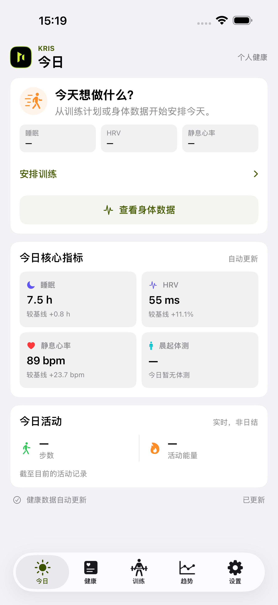
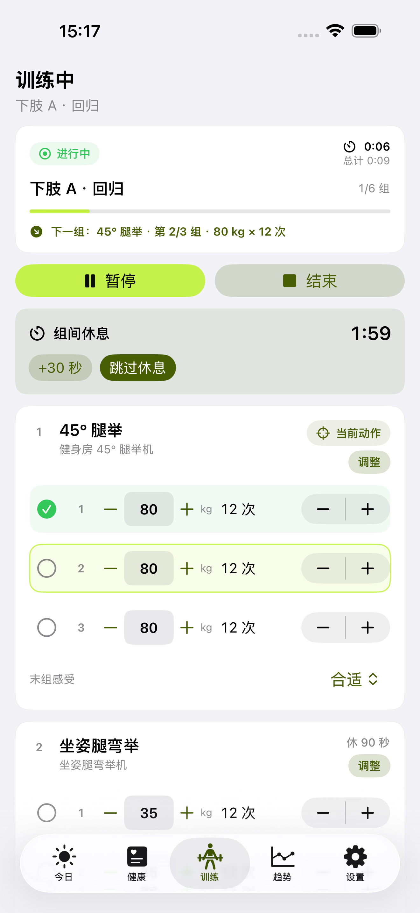
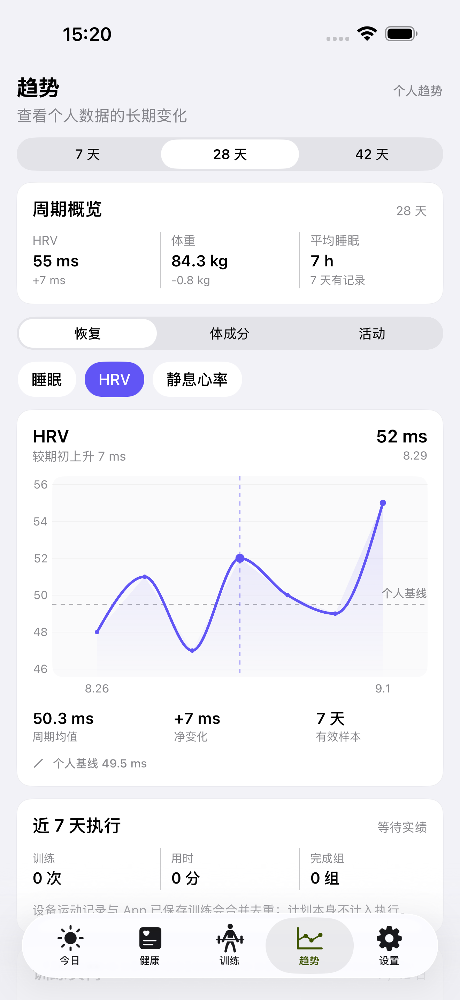
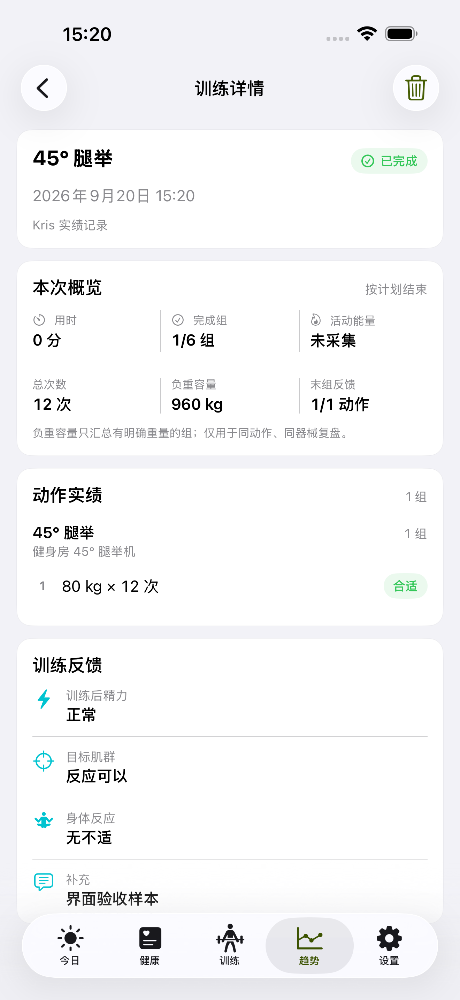

# Kris

产品商用预研、竞品矩阵、MVP 边界和版本路线图见 [docs/PRODUCT_STRATEGY.md](docs/PRODUCT_STRATEGY.md)；当前定位调整为“日常健康与专业训练”，见 [docs/PRODUCT_ROADMAP_2026-09-06.md](docs/PRODUCT_ROADMAP_2026-09-06.md)；当前实现状态、里程碑、优先级和 Alpha 研究计划见 [docs/COMMERCIAL_EXECUTION_PLAN.md](docs/COMMERCIAL_EXECUTION_PLAN.md)；逐项发布门槛见 [docs/MVP_RELEASE_CHECKLIST.md](docs/MVP_RELEASE_CHECKLIST.md)。

## 界面示例

以下画面由 iOS UI 测试使用固定夹具生成，仅用于展示产品流程，不包含真实 HealthKit 或个人训练数据。

<p align="center">
  
  
  
  
</p>

## 数据来源

- 长期结构化数据：环境变量 `KRIS_VAULT_DATA` 指向的 Obsidian 数据目录
- 当天执行与训练记录：原生 Kris iPhone / Apple Watch App
- 训练计划生成与发布：经版本化契约发布到 App

Apple Notes 只保留切换前的历史，不再作为新计划入口。Hermes 的会话数据库和 profile 不作为运行时依赖，原历史保留在本机供必要时查阅。

## 数据适配检查

每次在 SyncHealth 点击 `syncnow` 后，一条命令刷新全部派生数据并校验：

```bash
python3 tools/refresh_kris.py
```

分步执行：

```bash
python3 tools/verify_kris_data.py
python3 tools/verify_synchealth.py
python3 tools/build_daily_health_summary.py
python3 tools/build_training_intelligence.py
```

前两个检查只读 Obsidian 和本地手机健康数据库，不会修改、移动或删除任何源记录。`build_daily_health_summary.py` 生成健康日结；`build_training_intelligence.py` 生成逐组、容量、负荷、恢复和减脂监测；`build_coaching_monitor.py` 生成数据质量、周汇总与症状触发统计；`build_decision_support.py` 生成动作纪录、排课候选、心肺基线、周复盘输入和完成流程状态；`build_coach_brief.py` 生成带证据、置信度、行动建议和回退条件的每日教练简报。所有派生结果进入 `coach_snapshot.json`，原始数据库和历史训练/体测 CSV 不会被改写。

`coach_brief.json` 与 `今日教练简报.md` 是面向行动的决策层：它会把睡眠、HRV、静息心率、近期负荷、数据新鲜度、恢复基线和训练流程合并成一个临时或正式的准备度结论。该分数是个人趋势决策分，不是医疗评分；当天数据未结束、基线未完成或质量存在缺口时，不会自动授权加重或改变 TDEE。

## 同步后的手动刷新

你在 SyncHealth 点击 `syncnow` 并确认上传完成后，告诉我“数据已上传”，我会执行一次：

```bash
python3 tools/auto_refresh_kris.py --no-notify
```

`tools/auto_refresh_kris.py` 使用非阻塞文件锁和输入指纹，重复触发不会重复处理；只有刷新成功才提交成功状态，失败会保留重试条件。它不安装、不依赖任何定时任务，也不重启 SyncHealth 接收服务。状态保存在 `~/.synchealth/kris-auto-refresh-state.json`，健康原始数据始终由 SyncHealth 单独保存。

训练智能层包含两套受控规则；Swift 与 Python 保持同口径，日常展示和判断优先由 iPhone 本地运行，Python 用于长期归档、复核和黄金样本一致性验证：

- `gated_double_progression_v1`：同动作、同器械、同重量口径的双进阶状态机。只有连续两次相同方案全部达到次数上限，且明确反馈为“轻松/合适”时才开放最小档加重；缺失反馈不会被当作动作正常。
- 7/42 日指数负荷趋势：同时输出短期负荷、长期负荷和训练前一日负荷平衡。历史未满42天时固定标记为基线建立中；该模型只提供个人训练语境，不预测伤病，也不单独决定训练或休息。

只读检查 Apple Notes 历史计划：

```bash
python3 tools/list_kris_notes.py
```

## Kris V1 PWA

已加入一个本地优先的可安装 Web App：

```bash
python3 app/server.py
```

打开 <http://127.0.0.1:8765> 即可查看。它读取现有 `coach_snapshot.json` 与趋势 CSV，不上传健康数据、不自动轮询；SyncHealth 手动刷新并运行教练管线后，点击页面右上角 `↻` 重新读取。详细说明见 `app/README.md`。

该脚本只列出 `Kris 健身` 文件夹内的标题和 Notes ID，并设置 8 秒超时，不会写入或移动备忘录。

## 原生 SwiftUI App

原生工程位于 `native/`，包含 iPhone App、Apple Watch App/Extension、SwiftData 本地队列、HealthKit 增量读取、WatchConnectivity 和测试目标。

打开工程：

```bash
open native/KrisCoach.xcodeproj
```

在 Xcode 中选择 `KrisCoach Preview` scheme 可直接运行 iPhone 预览版。该 target 使用 `TrainingPlan.sample.json`，适合在没有真实计划或 HealthKit 权限时检查界面和离线训练流程。正式 `KrisCoach` target 不打包演示计划，真实计划通过结构化导入进入 iPhone；正式 target 会嵌入 Watch App，真机安装前需在 Xcode > Settings > Components 安装与 SDK 匹配的 watchOS runtime，并在 Apple Watch 上启用开发者模式。

命令行验证：

```bash
xcodebuild test \
  -project native/KrisCoach.xcodeproj \
  -scheme 'KrisCoach' \
  -destination 'platform=iOS Simulator,name=iPhone 17 Pro Max,OS=26.5' \
  CODE_SIGNING_ALLOWED=NO

xcodebuild -project native/KrisCoach.xcodeproj \
  -target 'KrisCoach Watch' -sdk watchos \
  CODE_SIGNING_ALLOWED=NO build
```

Mac companion：

```bash
python3 -m companion.server --help
python3 -m companion.pair --help
```

Apple 健康是 iPhone App 的直接数据源，不需要扫码、Mac 或 SyncHealth。用户只需在“设置 → Apple 健康”中完成一次 iOS 系统授权；首次授权回溯 42 天，之后由 HealthKit observer 自动接收变化，并在 App 启动或回到前台时用 anchored query 自动补齐，不需要日常手动同步。iOS 决定后台唤醒时机，因此这里是事件驱动的近实时更新，不承诺秒级到达，也不使用分钟级或小时级轮询。授权不完整时保留已取得的数据并降低置信度，不伪造正常状态。HealthKit 批量导入期间只合并保存样本，派生历史在导入结束后统一刷新；后台投递注册不会阻塞前台页面。

AI Decision Pipeline V2 已作为开发态默认链路接入：App 只把最小化、结构化的 `TrainingContext.v2` 发送给 provider-neutral Kris Gateway，接收 `AIRecommendation.v2`，再经过本地 evidence、safety、progression、计划结构与采用时新鲜度校验。AI 只能产生待审核建议；用户明确采用后才会原子创建计划 revision，Watch 训练期间不调用 AI。V1 candidate 仅保留解码、查看和拒绝兼容，不能再直接发布。未接通网关、断网、限流或 Provider 故障均不影响 Apple 健康、本地分析和训练执行。完整边界与验收状态见 [`docs/AI_DECISION_PIPELINE_V2.md`](docs/AI_DECISION_PIPELINE_V2.md)。

AI Gateway 位于 `services/ai_gateway/`，开发态同时保留 V1 兼容入口和默认的 `POST /v2/ai/training-recommendations`。当前只启用确定性 Stub Provider 和开发期 HMAC 会话，用于跑通鉴权、严格 schema、evidence 引用、限流、幂等与 metadata-only 审计；生产模式会主动拒绝启动。App 的网关地址只能通过构建设置 `KRIS_AI_GATEWAY_URL` 注入，短期 Kris 设备会话只保存在 Keychain，二者都不作为用户设置。开发期入口为：

```bash
python3 -m services.ai_gateway.server
python3 -m services.ai_gateway.issue_dev_token opaque-test-device
python3 -m unittest -v tests.test_ai_gateway
```

运行前需要在服务端进程环境中提供至少 32 字节的 `KRIS_AI_GATEWAY_SESSION_SECRET`。该变量只签发本地开发会话，不是 DeepSeek API Key，也不得用于正式环境。

恢复与健康分析、完整日能量趋势、训练历史、7/42 日负荷、动作双进阶、数据质量和决策解释均在 iPhone 本地运行；Apple Watch 与 App 的重复 workout 会在端侧去重。训练计划可由用户或外部教练工具生成结构化文件后导入 App，当前开发期的历史归档兼容链路不属于日常使用前提。Apple 健康授权后由系统通知与前台补齐机制更新，不需要扫码、局域网服务或 SyncHealth；离线训练记录和健康缓存保留在本机。

正式训练开始后会锁定已发布计划修订，但允许按健身房现场情况调整本次动作、器械、目标重量、组数、次数和休息。执行覆盖随草稿离线保存；中途换器械前后的已完成组分别保留实际身份，归档同时携带原计划与实际执行。训练期间从锁屏或后台回到 App 时跳过完整 HealthKit 维护；观察到的健康数据变化先合并排队，训练结束后再补刷新，避免阻塞组次记录。

App 不做分钟级或小时级轮询。模拟器没有真实 HealthKit 数据时，页面会明确显示“等待本地健康数据”，不会伪造准备度。

正式 iPhone App 的最低部署条件是 iOS 26；Apple 健康读取和端侧分析不要求 Mac 在线。Watch 训练伴侣需要 watchOS 26 和已配对的 Apple Watch；计划导入、训练执行和历史查看均可在 iPhone 本地完成。没有付费 Apple Developer 账号时，可使用 Personal Team 开发签名，但安装包需要按 Apple 的开发版签名周期重新签名。当前开发机已识别 iPhone 17 Pro Max；若 `xcrun devicectl list devices` 未列出 Apple Watch，只能完成 Watch 编译验收，不能完成真机 Watch 端到端验收。
